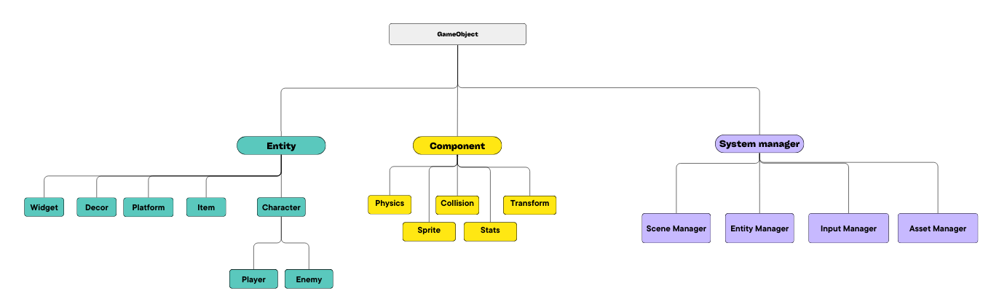

## Générer la solution

Afin de générer la solution il faut:
- Télécharger le projet sur git
- Avoir un compiler c++ (par exemple visual studio)
- Installer [vcpkg](https://learn.microsoft.com/en-us/vcpkg/get_started/get-started?pivots=shell-cmd)
- Installer [CMAKE](https://cmake.org/download/)
- Vérifier dans les variables d'environnements systèmes que les variables suivantes sont ajoutées au *Path*,(le cas contraire ajouté les selon leurs chemins d'installations) :
    - cmake/bin
    - vcpkg
- Lancer CMAKE, cliquer sur "browse source..." et sélectionner le dossier racine du projet
- Sélectionner ensuite sur la liste déroulante de "preset: " et cliquer sur "DEV"
- Cliquer ensuite sur "Configure" et attendre la fin de la configuration (cela peut prendre plusieurs minutes)
    - Si CMAKE demande de créer le *build directory* car inexistant, accepter
    - Lors de la demande, sélectionner votre compiler et laisser les options par défaut
- Enfin, il suffit de cliquer sur Generate et la solution se trouvera dans le dossier indiqué dans le champ "Where to build the binaries: "

## Configuration
Afin de lancer le projet il faut:
- Ouvrir la solution *timeless_traverse.sln* se trouvant dans le dossier ../out/binaries du projet
- Dans la fenêtre "explorateur de solution", faire un clique droit sur le nom du projet et sélectionner "Définir en tant que projet de démarrage"
- Configurer votre working directory en indiquant le chemin du projet (pointant le dossier contenant *Asset, Components, Entities ...*)
- Le projet peut maintenant être démarré en cliquant sur le bouton play

## Architecture du projet

